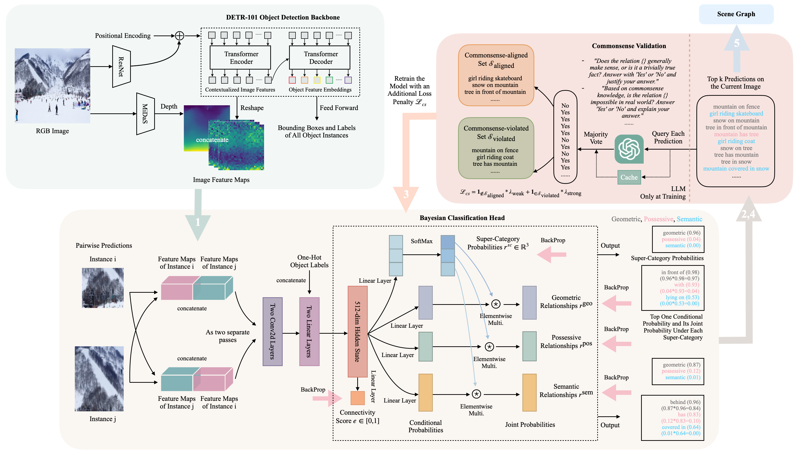

# This repository contains the implementation of the algorithm proposed in the paper "Scene Graph Generation from Hierarchical Relationship Reasoning".

Illustration of our scene graph construction scheme. The DETR detection backbone generates image features, instance bounding boxes and labels. The local predictor predicts pairwise relationships. It uses bounding boxes to extract subject and object feature tensors separately, concatenates them in both directions, and feeds them to our Bayesian prediction head. The figure shows two paths representing the two ways in which the objects can be ordered. Each of these tensors is passed to the Bayesian prediction head in turn. The head predicts the super-category distribution and the conditional probabilities under each super-category. It produces three hypotheses for the relationship, one for each super-category. Each of these hypotheses is scored by computing the product of the edge connectivity score and the maximum entry in each of the three final vectors. In the results, pink predicates are true positive, blue predicates are reasonably true predictions but not annotated in the dataset, and gray predicates are false positive


## Dependencies:
  - python >= 3.6.9
  - torch >= 1.10.1+cu102 
  - torchvision >= 0.11.2+cu102
  - numpy
  - json
  - yaml
  - os
  - PIL
  - string
  - tqdm
  - collections
  - math
  - copy
  - typing
  - transformers


## Dataset:
  Please refer to [datasets/README.md](datasets/README.md) or [DATASET_README.md](DATASET_README.md) to download and prepare the dataset.


## Pretrained Models
  We provide the pretrained models in our paper. Please download and put them under the [checkpoints/](checkpoints/) directory.

  - DETR-101 object detection module: https://drive.google.com/file/d/1fnTP1VXhFzwPFLYqQAEtjuENg2nQUFJ_/view?usp=sharing
  - Local prediction modules on the third epoch: https://drive.google.com/file/d/1z9XNCPCZgCIkPFy54oEWsG-saYnLny-J/view?usp=sharing
  - Optional transformer encoder on the fifth epoch: https://drive.google.com/file/d/1GK1zV9TODI44rSqk1MRLYODlfGp4rnSA/view?usp=sharing
  - Prediction head on the fifth epoch if the optional transformer encoder is used: https://drive.google.com/file/d/1MNcaD7UlRpzQ3ad4gL9qpO43yBGurHqP/view?usp=sharing


## Quick Start:
  All hyper-parameters are listed in the [config.yaml](config.yaml) file.
  We train our code using four NVIDIA V100 GPUs with 32GB memory: ```export CUDA_VISIBLE_DEVICES=0,1,2,3```.
  Training and evaluation results will be automatically recorded and saved in the [results/](results/) directory.
  Please modify ```start_epoch```, ```test_epoch```, and ```continue_train``` based on your own experiment, where ```continue_train``` allows you to stop and resume the training process of the local prediction module.

  ### To train the local prediction module:
    In config.yaml, set
      training:
        run_mode: 'train'
        train_mode: 'local'
        continue_train: False
        start_epoch: 0

Execute ```python main.py```.

  ### To evaluate the local prediction module on predicate classification (PredCLS) tasks:
    In config.yaml, set
      training:
        run_mode: 'eval'
        train_mode: 'local'
        eval_mode: 'pc'
        test_epoch: 2

Execute ```python main.py```.

  ### To evaluate the local prediction module on scene graph detection (SGDET) tasks:
    In config.yaml, set
      training:
        run_mode: 'eval'
        train_mode: 'local'
        eval_mode: 'sgd'
        test_epoch: 2

Execute ```python main.py```.

  ### To train the model with the optional transformer encoder:
    In config.yaml, set
      training:
        run_mode: 'train'
        train_mode: 'global'
        continue_train: True
        start_epoch: 3

Execute ```python main.py```.

  ### To evaluate the model with the optional transformer encoder on predicate classification (PredCLS) tasks:
    In config.yaml, set
      training:
        run_mode: 'eval'
        train_mode: 'global'
        eval_mode: 'pc'
        test_epoch: 5

Execute ```python main.py```.

  ### To evaluate the local prediction module on scene graph detection (SGDET) tasks:
    In config.yaml, set
      training:
        run_mode: 'eval'
        train_mode: 'global'
        eval_mode: 'sgd'
        test_epoch: 5

Execute ```python main.py```.


## Training results
PredCLS
| R@20 | R@50 | R@100 | mR@20 | mR@50 | mR@100 | R@20^{*} | R@50 | R@100 | mR@20 | mR@50 | mR@100 |
| ---- | ---- | ----- | ----- | ----- | ------ | ---- | ---- | ----- | ----- | ----- | ------ |
| 60.5 | 73.2 | 77.9  | 14.8  | 21.5  |  24.9  | 60.5 | 73.2 | 77.9  | 14.8  | 21.5  |  24.9  |


## Examples of the generated scene graphs


All samples come from the Visual Genome test dataset. Each edge is annotated with 3 possible labels, one for each relationship super-category. The numbers show the systems belief that that super-category estimate is the correct one. We show all edges that contain predicates among the top 5 most confident predictions and other true positive predictions among the top 20. We sketch four types of arrows: (1) solid pink arrow: contains true positive predicates. (2) dotted pink arrow: false negative predicates, relationships that are in the ground truth annotation that are missed. (3) solid blue arrow: represent reasonable true positives that are not annotated in the dataset. (4) solid gray arrow: represent false positive predicates.
